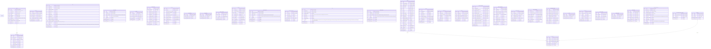

```mermaid
erDiagram
    mahasiswa {
    }
    users {
        bigint id PK "not null, unsigned"
        bigint role_id "not null, default: 6, unsigned"
        bigint pegawai_id UK "nullable, unsigned"
        varchar username "not null, (255)"
        varchar email UK "not null, (255)"
        varchar password "nullable, (255)"
        varchar status "not null, (255)"
        enum auth_type "not null, default: local, values: local,ldap"
        timestamp ldap_synced_at "nullable"
        varchar remember_token "nullable, (100)"
        timestamp created_at "nullable"
        timestamp updated_at "nullable"
    }
    arsip_files {
        bigint id PK "not null, unsigned"
        bigint pegawai_id "not null, unsigned"
        varchar file_name "not null, (255)"
        varchar file_path "not null, (255)"
        varchar jenis_file "not null, (255)"
        bigint uploaded_by "not null, unsigned"
        timestamp created_at "nullable"
        timestamp updated_at "nullable"
    }
    cuti {
        bigint id PK "not null, unsigned"
        bigint pegawai_id "not null, unsigned"
        bigint jenis_cuti_id "not null, unsigned"
        date tanggal_pengajuan "not null"
        date tanggal_mulai "not null"
        date tanggal_selesai "not null"
        time jam_mulai "nullable"
        time jam_selesai "nullable"
        int jumlah_hari_cuti "nullable"
        int jumlah_jam "nullable"
        int saldo_cuti_sebelum "nullable"
        int saldo_cuti_sesudah "nullable"
        varchar dokumen_pendukung "nullable, (255)"
        enum metode_potongan "nullable, values: potong_cuti,potong_gaji"
        text keterangan "nullable"
        enum status "not null, default: Menunggu Verifikasi Pimpinan, values: Menunggu Verifikasi Pimpinan,Menunggu Verifikasi Rektor,Menunggu Verifikasi SDM Universitas,Menunggu Verifikasi SDM Yayasan,Disetujui,Ditolak"
        timestamp created_at "nullable"
        timestamp updated_at "nullable"
    }
    cuti_approval {
        bigint id PK "not null, unsigned"
        bigint cuti_id "not null, unsigned"
        bigint approved_by "not null, unsigned"
        enum role_approval "not null, values: Pimpinan,Rektor,SDM Yayasan,SDM Universitas"
        enum status "not null, values: Disetujui,Ditolak"
        text catatan "nullable"
        timestamp approved_at "nullable"
        timestamp created_at "nullable"
        timestamp updated_at "nullable"
    }
    hari_libur {
        bigint id PK "not null, unsigned"
        date tanggal "not null"
        varchar nama_hari_libur "not null, (255)"
        varchar jenis_hari_libur "not null, (255)"
        varchar keterangan "nullable, (255)"
        timestamp created_at "nullable"
        timestamp updated_at "nullable"
    }
    import_pegawai {
        bigint id PK "not null, unsigned"
        varchar file_name "not null, (255)"
        varchar file_path "not null, (255)"
        bigint imported_by FK "not null, unsigned"
        int total_rows "nullable"
        int total_success "nullable"
        int total_failed "nullable"
        int total_duplicate "nullable"
        timestamp created_at "nullable"
        timestamp updated_at "nullable"
    }
    import_presensi {
        bigint id PK "not null, unsigned"
        varchar file_name "not null, (255)"
        varchar file_path "not null, (255)"
        date periode_mulai "nullable"
        date periode_selesai "nullable"
        int total_rows "nullable"
        int total_created "nullable"
        int total_updated "nullable"
        int total_skipped "nullable"
        int total_failed "nullable"
        json error_summary "nullable"
        bigint imported_by "not null, unsigned"
        timestamp created_at "nullable"
        timestamp updated_at "nullable"
    }
    jenis_cuti {
        bigint id PK "not null, unsigned"
        varchar nama "not null, (255)"
        int minimal_masa_kerja_bulan "nullable"
        int minimal_hari_pengajuan "nullable"
        int maksimal_hari "nullable"
        int maksimal_hari_per_bulan "nullable"
        tinyint memotong_saldo "not null, default: 1, (1)"
        tinyint butuh_surat_dokter "not null, default: 0, (1)"
        tinyint dihitung_per_jam "not null, default: 0, (1)"
        tinyint sekali_seumur_kerja "not null, default: 0, (1)"
        text deskripsi "nullable"
        timestamp created_at "nullable"
        timestamp updated_at "nullable"
    }
    jenis_keluarga {
        bigint id PK "not null, unsigned"
        varchar jenis "not null, (255)"
        timestamp created_at "nullable"
        timestamp updated_at "nullable"
    }
    jenis_pegawai {
        bigint id PK "not null, unsigned"
        varchar jenis "not null, (255)"
        timestamp created_at "nullable"
        timestamp updated_at "nullable"
    }
    jenjang_pendidikan {
        bigint id PK "not null, unsigned"
        varchar kode "not null, (255)"
        varchar nama "not null, (255)"
        int urutan "nullable, unsigned"
        timestamp created_at "nullable"
        timestamp updated_at "nullable"
    }
    keluarga {
        bigint id PK "not null, unsigned"
        bigint pegawai_id UK "not null, unsigned"
        bigint jenis_keluarga_id UK "not null, unsigned"
        varchar nama UK "not null, (255)"
        varchar tempat_lahir "not null, (255)"
        date tanggal_lahir UK "not null"
        varchar pekerjaan "nullable, (255)"
        varchar alamat "nullable, (255)"
        varchar no_telpon "nullable, (255)"
        bigint updated_by "nullable, unsigned"
        timestamp deleted_at "nullable"
        timestamp created_at "nullable"
        timestamp updated_at "nullable"
    }
    laporan_approval {
        bigint id PK "not null, unsigned"
        bigint laporan_hasil_lembur_id "not null, unsigned"
        bigint approved_by "not null, unsigned"
        enum role_approval "not null, values: Pimpinan,Rektor,SDM Yayasan,SDM Universitas"
        enum status "not null, default: Menunggu Verifikasi Atasan, values: Menunggu Verifikasi Atasan,Disetujui,Ditolak"
        text catatan "nullable"
        timestamp approved_at "nullable"
        timestamp created_at "nullable"
        timestamp updated_at "nullable"
    }
    laporan_hasil_lembur {
        bigint id PK "not null, unsigned"
        bigint lembur_id UK "not null, unsigned"
        time jam_mulai "not null"
        time jam_selesai "not null"
        text hasil_pekerjaan "not null"
        varchar file_laporan "not null, (255)"
        timestamp created_at "nullable"
        timestamp updated_at "nullable"
    }
    lembur {
        bigint id PK "not null, unsigned"
        bigint pegawai_id "not null, unsigned"
        bigint surat_perintah_lembur_id "nullable, unsigned"
        date tanggal_lembur "not null"
        enum jenis_hari "not null, values: Hari Kerja Normal,Hari Libur Mingguan,Hari Libur Nasional"
        time jam_mulai "not null"
        time jam_selesai "not null"
        text alasan_lembur "nullable"
        enum status "not null, default: Menunggu Verifikasi Atasan, values: Menunggu Pelaksanaan,Menunggu Verifikasi Atasan,Menunggu Verifikasi Rektor,Menunggu Verifikasi SDM Universitas,Menunggu Verifikasi SDM Yayasan,Menunggu Laporan,Selesai,Ditolak"
        timestamp created_at "nullable"
        timestamp updated_at "nullable"
    }
    lembur_approval {
        bigint id PK "not null, unsigned"
        bigint lembur_id "not null, unsigned"
        bigint approved_by "not null, unsigned"
        enum role_approval "not null, values: Pimpinan,Rektor,SDM Yayasan,SDM Universitas"
        enum status "not null, default: Menunggu Verifikasi Atasan, values: Menunggu Verifikasi Atasan,Disetujui,Ditolak"
        text catatan "nullable"
        timestamp approved_at "nullable"
        timestamp created_at "nullable"
        timestamp updated_at "nullable"
    }
    pegawai {
        bigint id PK "not null, unsigned"
        bigint jenis_pegawai_id "nullable, unsigned"
        bigint status_pegawai_id "nullable, unsigned"
        bigint unit_kerja_id "nullable, unsigned"
        varchar unit_bagian "nullable, (255)"
        varchar nip UK "not null, (255)"
        varchar ktp UK "not null, (255)"
        varchar npwp UK "nullable, (255)"
        varchar nama "not null, (255)"
        varchar gelar_depan "nullable, (255)"
        varchar gelar_belakang "nullable, (255)"
        varchar tempat_lahir "nullable, (255)"
        date tanggal_lahir "not null"
        date tanggal_bergabung "not null"
        date tanggal_habis_kontrak "nullable"
        date tanggal_pensiun "nullable"
        varchar jenis_kelamin "nullable, (255)"
        text alamat_ktp "nullable"
        text alamat_domisili "nullable"
        varchar no_telpon "nullable, (255)"
        varchar email_yarsi "nullable, (255)"
        varchar status "nullable, (255)"
        timestamp created_at "nullable"
        timestamp updated_at "nullable"
    }
    presensi {
        bigint id PK "not null, unsigned"
        bigint pegawai_id UK "not null, unsigned"
        date tanggal UK "not null"
        time jam_masuk "nullable"
        time jam_keluar "nullable"
        bigint status_kehadiran_id "nullable, unsigned"
        bigint last_import_presensi_id "nullable, unsigned"
        bigint created_by "nullable, unsigned"
        bigint updated_by "nullable, unsigned"
        timestamp created_at "nullable"
        timestamp updated_at "nullable"
    }
    presensi_log {
        bigint id PK "not null, unsigned"
        bigint presensi_id "not null, unsigned"
        bigint import_presensi_id "not null, unsigned"
        bigint edited_by "nullable, unsigned"
        json changes "not null"
        text keterangan "nullable"
        timestamp created_at "nullable"
        timestamp updated_at "nullable"
    }
    rekening {
        bigint id PK "not null, unsigned"
        bigint pegawai_id "not null, unsigned"
        varchar nama_bank "not null, (255)"
        varchar nomor_rekening UK "not null, (255)"
        varchar nama_rekening "not null, (255)"
        bigint updated_by "not null, unsigned"
        timestamp created_at "nullable"
        timestamp updated_at "nullable"
    }
    riwayat_kepangkatan {
        bigint id PK "not null, unsigned"
        bigint pegawai_id "not null, unsigned"
        varchar golongan_internal_yarsi "not null, (255)"
        varchar golongan_lldikti "not null, (255)"
        varchar fungsional_internal_yarsi "not null, (255)"
        varchar fungsional_lldikti "not null, (255)"
        varchar no_sk_golongan_internal_yarsi "not null, (255)"
        varchar no_sk_golongan_lldikti "not null, (255)"
        varchar no_sk_fungsional_internal_yarsi "not null, (255)"
        varchar no_sk_fungsional_lldikti "not null, (255)"
        date tanggal_berlaku_gol_internal_yarsi "not null"
        date tanggal_berlaku_gol_lldikti "not null"
        date tanggal_berlaku_fung_internal_yarsi "not null"
        date tanggal_berlaku_fung_lldikti "not null"
        timestamp created_at "nullable"
        timestamp updated_at "nullable"
    }
    riwayat_kepegawaian {
        bigint id PK "not null, unsigned"
        bigint pegawai_id "not null, unsigned"
        bigint unit_kerja_id "not null, unsigned"
        bigint status_pegawai_id "not null, unsigned"
        date tanggal_bergabung "not null"
        varchar nomor_sk "not null, (255)"
        date tanggal_sk "not null"
        text isi_sk "not null"
        date tanggal_berlaku "not null"
        date tanggal_berakhir "nullable"
        date tanggal_pensiun "nullable"
        varchar status_keaktifan "not null, (255)"
        timestamp created_at "nullable"
        timestamp updated_at "nullable"
    }
    riwayat_pelatihan {
        bigint id PK "not null, unsigned"
        bigint pegawai_id "not null, unsigned"
        varchar nama_kegiatan "not null, (255)"
        date tanggal_mulai "not null"
        date tanggal_selesai "not null"
        varchar pembiayaan "not null, (255)"
        timestamp created_at "nullable"
        timestamp updated_at "nullable"
    }
    riwayat_pendidikan {
        bigint id PK "not null, unsigned"
        bigint pegawai_id "not null, unsigned"
        bigint jenjang_pendidikan_id "not null, unsigned"
        smallint tahun_masuk "nullable, unsigned"
        smallint tahun_lulus "nullable, unsigned"
        varchar file_ijazah "nullable, (255)"
        varchar file_path "nullable, (255)"
        bigint updated_by "not null, unsigned"
        timestamp created_at "nullable"
        timestamp updated_at "nullable"
    }
    riwayat_tugas_belajar {
        bigint id PK "not null, unsigned"
        bigint pegawai_id "not null, unsigned"
        varchar nama_institusi "not null, (255)"
        varchar program_studi "not null, (255)"
        varchar nama_program "not null, (255)"
        date tanggal_mulai "not null"
        date tanggal_selesai "not null"
        varchar pembiayaan "not null, (255)"
        varchar file_name "not null, (255)"
        varchar file_path "not null, (255)"
        timestamp created_at "nullable"
        timestamp updated_at "nullable"
    }
    roles {
        bigint id PK "not null, unsigned"
        varchar name UK "not null, (255)"
        timestamp created_at "nullable"
        timestamp updated_at "nullable"
    }
    saldo_cuti {
        bigint id PK "not null, unsigned"
        bigint pegawai_id "not null, unsigned"
        year tahun "not null"
        int hak_cuti "not null"
        int cuti_terpakai "not null"
        int sisa_cuti "not null"
        timestamp created_at "nullable"
        timestamp updated_at "nullable"
    }
    status_kehadiran {
        bigint id PK "not null, unsigned"
        varchar kondisi "not null, (255)"
        varchar status "not null, (255)"
        varchar warna "not null, (255)"
        timestamp created_at "nullable"
        timestamp updated_at "nullable"
    }
    status_pegawai {
        bigint id PK "not null, unsigned"
        varchar status "not null, (255)"
        timestamp created_at "nullable"
        timestamp updated_at "nullable"
    }
    sumber_daya {
        bigint id PK "not null, unsigned"
        varchar judul "not null, (255)"
        varchar file_name "not null, (255)"
        varchar file_path "not null, (255)"
        varchar extension "not null, (255)"
        varchar mime_type "not null, (255)"
        bigint uploaded_by "not null, unsigned"
        timestamp created_at "nullable"
        timestamp updated_at "nullable"
    }
    surat_perintah_lembur {
        bigint id PK "not null, unsigned"
        varchar nomor_surat UK "not null, (255)"
        bigint unit_kerja_id "not null, unsigned"
        date tanggal_dibuat "not null"
        varchar nama_kegiatan "not null, (255)"
        text deskripsi_tugas "not null"
        enum jenis_hari "not null, values: Hari Kerja Normal,Hari Libur Mingguan,Hari Libur Nasional"
        date tanggal_lembur "not null"
        time jam_mulai "not null"
        time jam_selesai "not null"
        enum status "not null, default: Diterbitkan, values: Diterbitkan,Dibatalkan"
        timestamp created_at "nullable"
        timestamp updated_at "nullable"
    }
    surat_perintah_lembur_pegawai {
        bigint id PK "not null, unsigned"
        bigint surat_perintah_lembur_id "not null, unsigned"
        bigint pegawai_id "not null, unsigned"
        timestamp created_at "nullable"
        timestamp updated_at "nullable"
    }
    unit_kerja {
        bigint id PK "not null, unsigned"
        bigint parent_id "nullable, unsigned"
        bigint pimpinan_id FK "nullable, unsigned"
        bigint unit_sdm_id FK "nullable, unsigned"
        varchar name "not null, (255)"
        timestamp created_at "nullable"
        timestamp updated_at "nullable"
    }
    unit_sdm {
        bigint id PK "not null, unsigned"
        bigint hr_id "nullable, unsigned"
        varchar name "not null, (255)"
        timestamp created_at "nullable"
        timestamp updated_at "nullable"
    }
    users ||--o{ import_pegawai : "has many"
    pegawai o|--o{ unit_kerja : "has many"
    unit_sdm o|--o{ unit_kerja : "has many"

```
